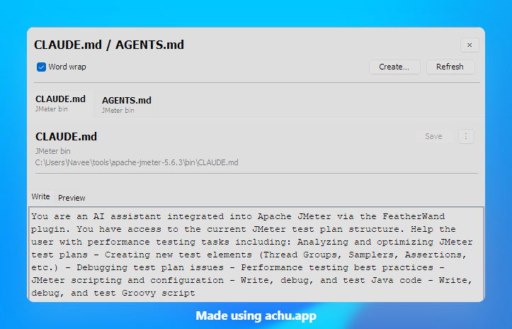
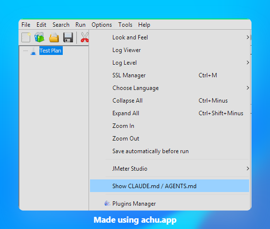

# README Config Element - JMeter Plugin

> A JMeter Config Element that lets you embed **Markdown documentation** directly inside your test plan  with a live GitHub-style preview and deep-link navigation to tree nodes.

## Screenshots

### CLAUDE.md and AGENTS.md editor




### README Config Element


---

## What is it?

**README Config Element** adds a documentation node to any JMeter test plan. It renders Markdown with a live preview panel so teams can keep context, runbooks, or notes right alongside the samplers they describe.

The Config Element is **always disabled**  it never fires during a test run and has zero performance impact. It is purely a documentation artifact.

---

## Features

- **Markdown editor** monospaced Write tab with syntax-aware line wrapping off
- **Live GitHub-style preview**
- **GitHub Flavored Markdown (GFM)** support:
  - Tables
  - Strikethrough (`~~text~~`)
  - Task list checkboxes (`- [ ]` / `- [x]`)
- **External hyperlinks**  clicked URLs open in your system browser
- **JMeter deep-links**  `jmeter://Node%20Name` links select and scroll to the matching node in the test plan tree
- **Always-disabled**
  - cannot be accidentally enabled; never counted in test results
  - do not use any threads during test run
- Theme aware
- Persists content inside the `.jmx` file like any other test element

---

## Requirements

| Requirement | Version |
|---|---|
| Apache JMeter | 5.6.3 + |
| Java | 21 + |

---

## Installation

### Option 1

```bash
# Set JMETER_HOME, then:
mvn clean install
```

The `maven-antrun-plugin` copies the fat-jar to `$JMETER_HOME/lib/ext` automatically.

### Option 2

```bash
mvn clean package
cp target/readme-config-element-0.1.0-jar-with-dependencies.jar $JMETER_HOME/lib/ext/
```

Restart JMeter after copying.

---

## Usage

1. Right-click any node in the test plan tree → **Add → Config Element → README Config Element**
2. Type Markdown in the **Write** tab
3. Switch to the **Preview** tab to see the rendered output

### Deep-linking to test plan nodes

Use the custom `jmeter://` protocol to create clickable links that navigate the tree:

```markdown
See the [Login Request](jmeter://Login%20Request) sampler for details.
```

Clicking the link in Preview selects the node named `Login Request` in the tree.  
A warning dialog is shown if the node cannot be found.

### Editing CLAUDE.md and AGENTS.md

Open **Options → Show CLAUDE.md / AGENTS.md** to edit project instruction files without leaving JMeter.

The panel detects both filenames from:

1. The directory containing the saved `.jmx` file
2. The nearest Git root
3. `$JMETER_HOME/bin`

Each detected file appears in its own tab with its resolved path and source. The editor provides Write and Preview modes, persistent word wrapping, safe Save/Reload/Revert actions, and explicit creation of missing files. Changes are written to the actual Markdown files rather than copied into the `.jmx`; external modifications are detected before saving.

---

## Building

```bash
mvn clean package          # produces target/readme-config-element-0.1.0-jar-with-dependencies.jar
mvn test                   # runs JUnit 5 unit tests
```

---

## License

[MIT](./LICENSE.md)
